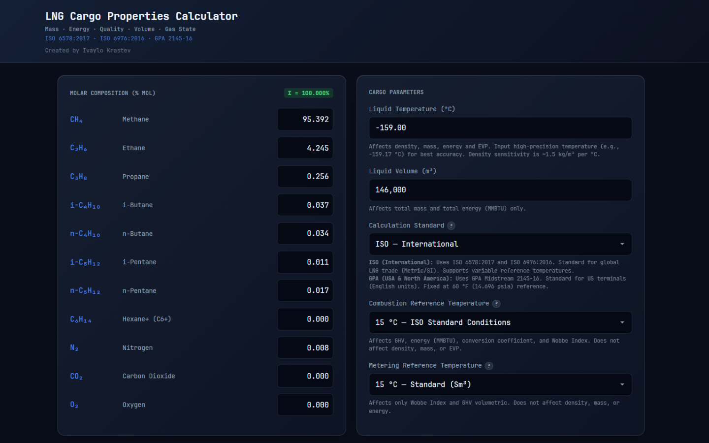
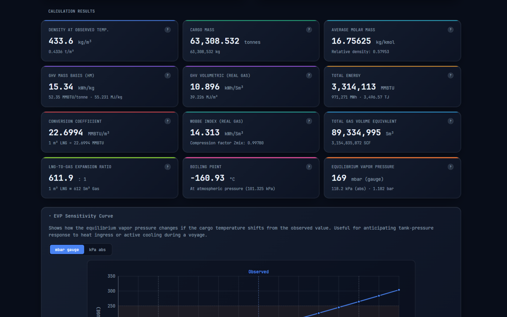
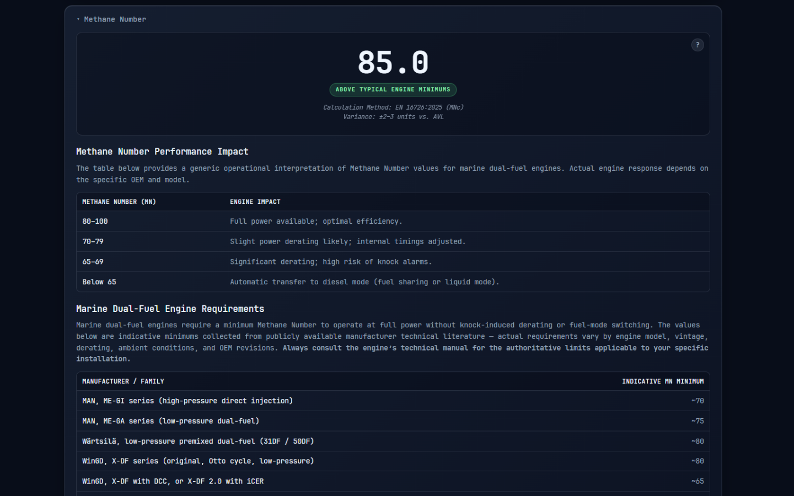
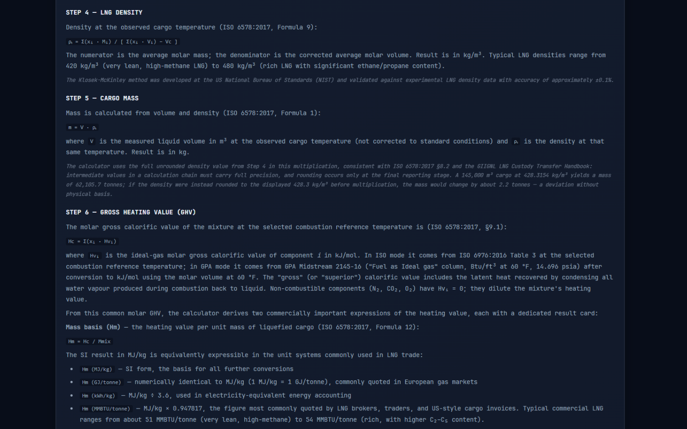

  

<h1 align="center">LNG Cargo Properties Calculator</h1>

  
  
  
  

Determines the physical, energy, and gas-phase properties of an LNG cargo from a measured composition, liquid volume, and temperature. Built for cargo surveyors, terminal operators, ship officers, and commercial analysts who require high-fidelity property estimates derived from a rigorous implementation of industry-standard methods.

**🌐 Live App:** **[https://lng.ivaylokrastev.com](https://lng.ivaylokrastev.com)**
> Once installed, the app works fully offline. For isolated offline workstations, you can download a [standalone HTML version](./LNG_Cargo_Properties_Calculator.html). On the next page, click the "Download raw file" icon in the top-right corner of the code box. Jump to the [Installation](#installation) section for additional information.

---

## Screenshots

**Main calculator view:**

**Calculation results:**

**Methane Number panel:**

**Theory and documentation panel:**

---

## What it calculates

From three measured inputs, the tool produces twelve commercially and operationally significant cargo properties, plus an extensive panel of intermediate values for audit and verification.

### Inputs
- **Molar composition** — mole fractions of eleven components: CH₄, C₂H₆, C₃H₈, i-C₄H₁₀, n-C₄H₁₀, i-C₅H₁₂, n-C₅H₁₂, C₆+, N₂, CO₂, O₂
- **Liquid temperature** — cargo temperature at the time of measurement, in °C
- **Liquid volume** — measured liquid volume in m³ (locale-aware input accepts `145,000`, `145 000`, `145000.00`, etc.)
- **Calculation standard** — ISO (international) or GPA Midstream (US/North America)
- **Reference temperatures** — combustion and metering reference temperatures (fixed at 60 °F in GPA mode; user-selectable in ISO mode: 0, 15, 15.55, 20, or 25 °C combustion; 0, 15, 15.55, or 20 °C metering)

### Outputs (result cards)
1. **Density at observed temperature** — kg/m³ (+ t/m³ subtitle)
2. **Cargo mass** — tonnes (+ kg, and lb in GPA mode)
3. **Average molar mass** — kg/kmol (+ relative density subtitle)
4. **GHV mass basis (Hm)** — kWh/kg (+ MMBTU/tonne and MJ/kg subtitle)
5. **GHV volumetric (real gas)** — kWh/Sm³ or BTU/SCF (+ MJ/m³ subtitle)
6. **Total energy** — MMBTU (+ MWh and TJ subtitle)
7. **Conversion coefficient** — MMBTU/m³
8. **Wobbe Index (real gas)** — kWh/Sm³ or BTU/SCF (+ Zmix subtitle)
9. **Total gas volume equivalent** — Sm³ or SCF
10. **LNG-to-gas expansion ratio** — dimensionless
11. **Boiling point** — °C at atmospheric pressure (101.325 kPa)
12. **Equilibrium vapor pressure** — mbar gauge (+ kPa abs and bar subtitle)

In addition to the twelve result cards, a dedicated **Methane Number** panel reports the gas-fuel knock resistance (EN 16726:2025 / MNc method) for use by ship engineers and dual-fuel engine operators. See the Features section below for details.

### Intermediate & additional values
An expandable panel exposes the underlying 24 derived quantities used in the calculation chain — k₁, k₂, Vc, Hc, Zmix, summation factors, real-gas and ideal-gas GHV in multiple unit systems, Wobbe Index ideal-gas and real-gas in MJ/m³ and BTU/SCF, and others. A component contributions table shows the per-component xᵢMᵢ, xᵢVᵢ, xᵢHvᵢ, mass fractions, summation factors, and partial saturation pressures.

---

## Standards & methods

The calculation engine implements established industry-standard methods:

- **ISO 6578:2017** — *Refrigerated hydrocarbon liquids — Static measurement — Calculation procedure.* Provides the Klosek-McKinley volume-correction method for LNG liquid density (Formula 9), and the mass and energy calculation chain (Formulas 1, 4, 12).
- **ISO 6976:2016** — *Natural gas — Calculation of calorific values, density, relative density and Wobbe indices from composition.* Provides ideal-gas molar gross calorific values (Table 3), summation factors for the real-gas compression factor (Table 2), and dry-air compression factors (Annex A Table A.4).
- **GPA Midstream 2145-16** — *Table of Physical Properties for Hydrocarbons and Other Compounds of Interest to the Natural Gas and Natural Gas Liquids Industries.* Provides BTU/SCF heating values at 60 °F / 14.696 psia, summation factors, and molar masses for US-convention custody transfer.
- **Klosek-McKinley method** (NIST, 1970s) — the liquid-density correlation used under both standards, validated against experimental LNG data to ±0.1 %.
- **Antoine vapor-pressure correlation** — with NIST Chemistry WebBook and Yaws' Handbook constants, used for the equilibrium vapor pressure and boiling-point inversion.
- **IUPAC 2007 atomic weights** — for molar mass computation (C = 12.0107, H = 1.00794, N = 14.0067, O = 15.9994, S = 32.065).

The dual-standard design means the calculator matches the way cargo Certificates of Quality are actually issued: select **GPA** when reconciling a US-terminal COQ (Sabine Pass, Corpus Christi, Cameron, Freeport, Plaquemines, Elba Island, Port Arthur); select **ISO** when reconciling a European, Asian, Middle Eastern, or Australian COQ.

---

## Features

- **Extensive in-app theory documentation.** Twelve step-by-step derivations of every calculation, with source formulas attributed to their originating standards and clauses. Every result card has a `?` icon that scrolls to the corresponding theory step.
- **Methane Number panel.** Computes the gas-fuel methane number (EN 16726:2025 Annex A / MNc method) from the LNG composition, with a color-coded indicator (green / amber / red) against typical engine minimums. Includes an "Engine Impact" reference table explaining what each MN range means operationally (full power vs derating vs diesel-mode transfer) and a reference table of indicative MN minimums by manufacturer (MAN, Wärtsilä, WinGD, Rolls-Royce / Bergen) for quick comparison. Useful for ship engineers and dual-fuel engine operators making fuel-quality assessments alongside cargo accounting work — applies to both direct-drive arrangements (e.g., ME-GI, X-DF main engines) and electric arrangements (DFDE / TFDE with dual-fuel medium-speed gensets). The implementation has been validated against the LNG-relevant reference compositions in EN 16726 Annex A Table A.10, agreeing to within 1 MN unit.
- **EVP Sensitivity Curve.** A graph panel showing the equilibrium vapor pressure across a ±1.4 °C window around the observed cargo temperature, with shaded zones indicating the typical membrane LNG carrier tank-pressure operating range. A toggle switches the y-axis between mbar gauge (tank-instrumentation reading) and kPa absolute (thermodynamic bubble-point pressure). Helps surveyors and officers anticipate tank pressure response to heat ingress or active cooling during the voyage.
- **Cargo Conditioning panel.** A dual-axis chart and reference table showing the cumulative mass / volume / energy of liquid that must evaporate to cool the cargo to lower target temperatures (six steps of 0.2 °C, down to 1.0 °C below the observed value), and the equilibrium tank pressure at each target. Toggles let the user view the left axis in volume (m³), mass (tonnes), or energy (GJ), and the right axis in mbar gauge or kPa absolute. The accompanying table always shows every quantity in every unit so that a discharge plan can be evaluated against any specification format. Density at each target temperature is independently recomputed via Klosek-McKinley, so the volume figure reflects the colder, denser liquid rather than a constant-density approximation.
- **Full unit-system coverage.** Every quantity where multiple conventions exist (MJ/kg, kWh/kg, MMBTU/tonne, Btu/lb; MJ/m³, kWh/Sm³, BTU/SCF; Sm³, Nm³, SCF) is computed and exposed.
- **Real-gas correction** using the compression factor Z from ISO 6976:2016 Table 2 summation factors (or GPA 2145-16 equivalents).
- **Sanity warnings.** Out-of-scope cargo temperature, composition summation deviation, and excess CO₂ content (solubility flag at 100 ppm) trigger visible warnings without blocking calculation.
- **Clean printout.** Browser print produces a seven-page cargo report (Molar Composition · Cargo Parameters · Calculation Results · EVP Sensitivity Curve · Methane Number · Cargo Conditioning · Intermediate Values) with "Calculations provided for reference purposes only." in the page footer.
- **Offline-first.** Once loaded, the app runs entirely in-browser with no network dependency. Installable as a PWA on Windows, macOS, Linux, Android, and iOS for quick access.
- **Locale-robust inputs.** Liquid volume accepts both US notation (`145,000`) and European notation (`145.000` or `145 000`).
- **Embedded JetBrains Mono font** for consistent, legible typography of numerical data across every device and operating system.

---

## Installation

### As a web app
Open the [deployment URL](https://lng.ivaylokrastev.com) in any modern browser. The calculator runs immediately in the tab.

### As an installed app
- **Chrome / Edge / Brave (desktop & Android):** click the install icon (⊕) that appears in the address bar, or select "Install app" / "Add to Home screen" from the browser menu.
- **Safari (iOS / iPadOS):** tap the share button → "Add to Home Screen."
- **Safari (macOS 14+):** File → "Add to Dock."

Once installed, the app works fully offline and launches as a standalone window — no browser address bar, tabs, or menu visible, just the calculator. The PWA version also remembers your last-used cargo values across sessions so a cargo reconciliation in progress can be resumed the next day.

### As a standalone offline HTML file
A single-file offline version (`LNG_Cargo_Properties_Calculator.html`) is included in this repository. This is suitable for isolated workstations that have no internet access — for example, shipboard Cargo Control Room computers on an isolated LAN.
[Download the file](./LNG_Cargo_Properties_Calculator.html) once, copy it to any computer, and it runs in any browser with no network dependency, ever. No PWA install prompt appears in this mode, and no persistent state is saved (so multiple users can share one file without data contamination).

---

## Applicability and limitations

The calculator is designed for fully-refrigerated LNG at cargo conditions, not for pressurized or semi-refrigerated systems. The valid scope:

- Average molar mass ≤ 20 kg/kmol
- Nitrogen < 5 mol%, butanes < 5 mol%, pentanes+ < 1 mol%
- Temperature range: −167.15 °C to −155.15 °C (extrapolated outside this range)
- Vapor pressures near atmospheric — typical LNG carrier membrane tanks at 80–250 mbar gauge (with normal operating range 100–200 mbar gauge) are well within scope
- C₆+ content approximated as a linear extrapolation from n-pentane (valid for typical < 0.01 mol% commercial levels)
- Antoine vapor-pressure correlations most accurate in the 80–150 % range of each component's normal boiling point
- CO₂ above 0.01 mol% (100 ppm) triggers a solubility flag — solid-phase CO₂ may be present

Full applicability discussion and numerical accuracy expectations are documented in the in-app theory panel.

---

## Legal and attribution

### Disclaimer
The calculator is provided for reference and informational purposes only. Results are based on physical correlations and industry-standard methods with known accuracy bounds (±0.1 % for density under validated conditions); nonetheless, they should not be treated as authoritative custody-transfer figures or substituted for measurements produced by certified metering systems, official cargo surveyors or terminal-issued Certificates of Quality. Commercial decisions and regulatory submissions should always rely on the appropriate official documents.

### Source standards
This tool does not reproduce or distribute any copyrighted standards documents. It implements widely known calculation methods based on publicly available scientific principles, using numerical physical constants defined in the underlying standards — constants which are physical facts of nature (e.g., densities, heating values, molar masses, vapor pressures) and are generally not subject to copyright protection.

Users requiring the full text, formal specifications, or authoritative interpretation of the underlying standards should obtain **ISO 6578:2017**, **ISO 6976:2016**, and **GPA Midstream 2145-16** directly from the respective publishers (ISO at iso.org, GPA Midstream at gpamidstream.org).

No affiliation, endorsement, or certification by ISO, GPA Midstream, NIST, IUPAC, JetBrains, or any LNG terminal operator is claimed or implied.

### Font licensing
The calculator embeds the JetBrains Mono font subset, distributed under the SIL Open Font License, Version 1.1. The license notice is preserved inline within the application's source.

### Author
© 2026 Ivaylo Krastev · [ivaylokrastev.com](https://ivaylokrastev.com)

### License
This project is released under the **GNU Affero General Public License v3.0 (AGPL-3.0)** — see [LICENSE](LICENSE) for the full text.

**Attribution Notice (Important):**  
The original author’s name and copyright notice must be preserved in all copies and modified versions of this software.

**Internal Use:**  
Use of this software within a single organization, without redistribution or modification, does not trigger additional obligations beyond those defined by the AGPL license.

**Practical Use (Non-Technical Summary):**  
You are free to use this calculator in your operational and professional work, including within commercial companies and operations, without requiring additional permission from the author, as long as you are not redistributing or modifying the software.

**Modifications and Network Use:**  
If you modify this software and make it available to others — including as a hosted network service — you must:
- retain the original copyright and attribution notices, and  
- provide access to the complete corresponding source code under the same AGPL-3.0 license.

**Commercial Licensing:**  
If you wish to use this software without the obligations of the AGPL (for example, in proprietary systems without releasing source code), a commercial license may be obtained from the author.

**Third-Party Components:**  
The embedded JetBrains Mono font is licensed separately under the SIL Open Font License 1.1. Its license notice is preserved in the application source and is distinct from the AGPL license covering the calculator code.

The Methane Number calculation (introduced in v2.3.0) embeds a JavaScript implementation of the EN 16726 / MNc method by Joaquín Torrens, distributed under the MIT License (2024). The MIT license terms apply only to that specific section of the source code; the surrounding calculator code remains licensed under AGPL-3.0. The MIT copyright notice and license text are preserved inline in the application source. The method itself is documented by EUROMOT and codified in EN 16726:2025 Annex A — independent of any specific implementation.

---

## Changelog

### Version 2.4.0
- **New: Cargo Conditioning panel.** Reference panel showing the cumulative mass / volume / energy of liquid that must evaporate to cool the cargo by up to 1 °C below the observed temperature (six target temperatures in 0.2 °C steps), alongside the equilibrium tank pressure at each target. Toggles select the left-axis quantity (volume m³ / mass tonnes / energy GJ) and the right-axis pressure unit (mbar gauge / kPa abs); the reference table beneath the chart always carries every quantity in every unit. Density is recomputed by Klosek-McKinley at each target temperature, so the volume figure reflects the colder, denser liquid rather than a constant-density approximation. Lives in a new collapsible panel between the Methane Number panel and Intermediate Values, open by default. Included in the printed cargo report (page 6 of 7).
- **EVP Sensitivity Curve unit toggle.** Added a unit selector to switch the y-axis between mbar gauge (tank-instrumentation reading) and kPa absolute (thermodynamic bubble-point pressure). Tank-pressure operating bands are converted accordingly so the visual operating range stays meaningful in both units.
- **Theory Step 12 added.** Walks through the energy balance `m_evap = m · (Cp · ΔT) / (L_vap + Cp · ΔT)`, the composition-weighted Cp and L_vap from NIST Chemistry WebBook per-component values, the equilibrium tank pressure relationship, and the operational note that tank pressure must be held below the new EVP for active cooling. Clarifies the scope of the figures: cooling-only evaporation, separate from heat-ingress boil-off.
- **Data Sources:** Added NIST Chemistry WebBook citation for liquid heat capacity Cp,ᵢ and latent heat of vaporisation L_vap,ᵢ values used by the conditioning energy balance.

### Version 2.3.0
- **New: Methane Number panel.** Computes the methane number of the LNG composition per **EN 16726:2025 Annex A** (the MNc method, based on the original AVL approach with the 2005 and 2011 MWM amendments). Lives in a new collapsible panel between the EVP Sensitivity Curve and Intermediate Values, open by default. Includes a colour-coded indicator with bands aligned to the EN 16726:2025 framing (red < 65, amber 65–80, green > 80), a "Methane Number Performance Impact" reference table explaining the operational implications of the MN value, and an indicative MN-minimums table for major marine dual-fuel engine families (MAN, Wärtsilä, WinGD, Rolls-Royce / Bergen). The implementation has been validated against the LNG-relevant reference compositions in EN 16726 Annex A Table A.10, agreeing to within 1 MN unit. Now included in the printed cargo report (page 5 of 6).
- **Theory Step 11 added.** Walks through what the Methane Number measures, how the MNc method calculates it (with attribution to the MWM amendments credited within EN 16726 Annex A), how it compares to the AVL Methane 3.20 method that some OEMs (notably WinGD) reference, and the operational interpretation including the EN 16726:2025 baseline of MN ≥ 70 with explicit fallback to ≥ 65 for exemptions including LNG terminals (Table 1, Note 5) and the related informative Annex L. Applies to both direct-drive arrangements (e.g., ME-GI, X-DF main engines) and electric arrangements (DFDE / TFDE with dual-fuel medium-speed gensets).
- **Footer:** Added "Source Code" link with GitHub icon next to the website link for direct access to the project repository.
- **Performance:** Methane Number calculation is debounced (250 ms) to keep the calculator responsive during active typing.

### Version 2.2.1
- Install banner widened on desktop to match the calculator's content area (1200 px max-width, previously 600 px)
- README polish: corrected typical membrane-carrier operating-pressure range to match the EVP Sensitivity Curve chart

### Version 2.2.0
- **New: EVP Sensitivity Curve.** A graph of equilibrium vapor pressure versus cargo temperature, spanning ±1.4 °C around the observed value in 0.2 °C steps, with shaded zones indicating typical membrane LNG carrier operating pressure ranges (green for normal, orange for caution). Allows an at-a-glance read of how tank pressure will respond to heat ingress or active cooling during the voyage — useful for operational planning on board. Lives in a new collapsible panel between Calculation Results and Intermediate Values, open by default. Now included in the printed cargo report (page 4 of 5).
- Licensed under the **GNU Affero General Public License v3.0 (AGPL-3.0)** with header applied to the HTML source and scope explained in the README license section
- Install banner constrained to 600 px max-width on desktop, centered horizontally (previously spanned the full viewport); duration extended from 10 s to 15 s
- Banner title styled as "Install This App" (Title Case) for stronger visual presence

### Version 2.1.2
- Refined project documentation, updated metadata for SEO/PWA alignment, and polished UI copy for better clarity

### Version 2.1.1
- Fixed PWA restore: volume field now shows thousand-separator formatting immediately on reopen (previously required clicking into the field to see `146,000` instead of `146000`)
- Composition fields now normalize to three-decimal display on restore, matching how they format during normal use
- Input save trigger changed from every keystroke to field-commit only (change/blur), avoiding mid-edit values being persisted

### Version 2.1
- Persistent session memory on PWA installs — last-used composition, temperature, volume, and reference selections are restored on reopen
- Platform-aware install banner for Android, Windows, macOS, and iOS (previously iOS only)
- Auto-dismissing banner with a 10-second progress bar; manual dismiss still available
- Header subtitles shortened for better mobile legibility
- Offline standalone HTML file now included in the repository for isolated-workstation use
- New app icon

### Version 2.0
- Initial public release

